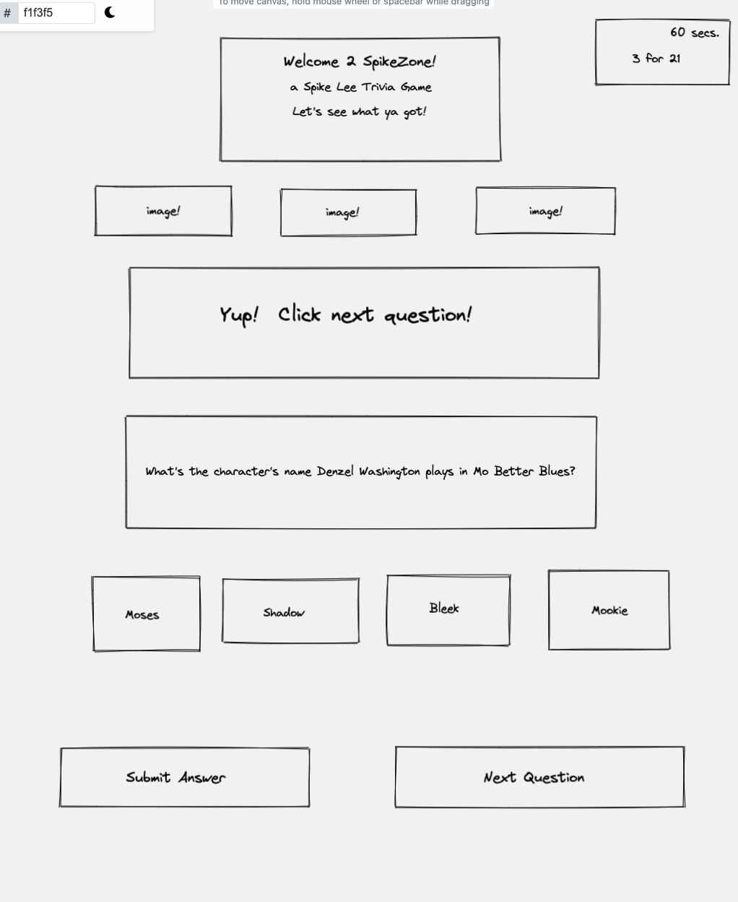

# SpikeZone
SEI 1025 Project 1: SpikeZone | A trivia games based on film director Spike Lee.

# Technical Requirements
The app must:

1. :white_check_mark: Display a game in the browser
2. :male-construction-worker::skin-tone-5: Switch turns between two players, or switch turns between a player and the computer (AI)*
3. :male-construction-worker::skin-tone-5: Design logic for winning & visually display which player won
4. :white_check_mark: Include separate HTML / CSS / JavaScript files 
5. :white_check_mark: Stick with KISS (Keep It Simple Stupid) and DRY (Don't Repeat Yourself) principles 
6. :white_check_mark: Use Javascriptd for DOM manipulation
7. :male-construction-worker::skin-tone-5: Deploy your game online, where the rest of the world can access it**
8. :white_check_mark: Use semantic markup for HTML and CSS (adhere to best practices) 

# How To Play

# How It Works
   
# Future Features
Sign up/log in feature.
Animated questions.
Mobile App.
Social Sharing Option.

# Initial Wireframe

